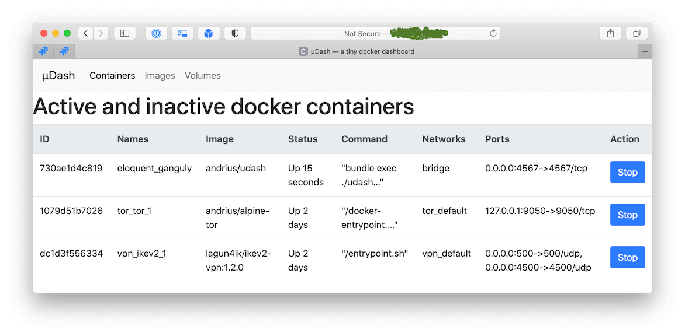

µDash
=====

A "dashboard" app that display status of the docker containers (`docker ps -a`)

# Screenshot



# Usage

```bash
docker run \
  -v /var/run/docker.sock:/var/run/docker.sock \
  -p 0.0.0.0:4567:4567 \
  andrius/udash
```

# Security

Use nginx proxy with htaccess restriction, like described [here](https://docs.docker.com/registry/recipes/nginx/).
